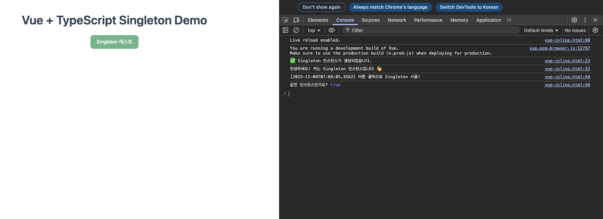
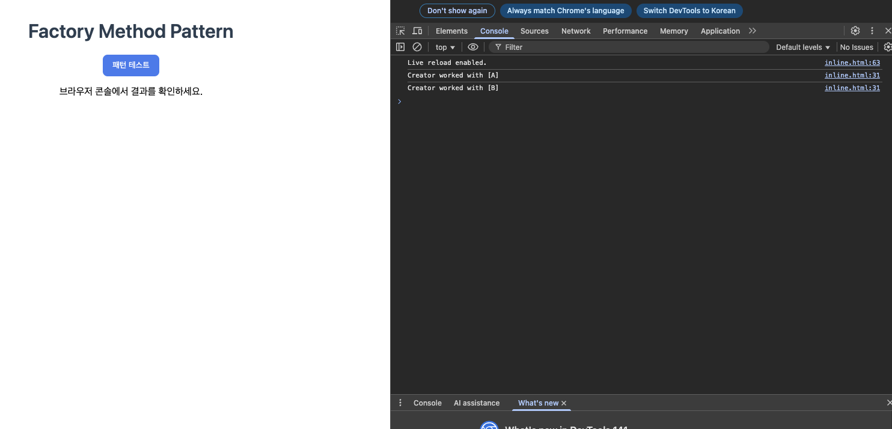
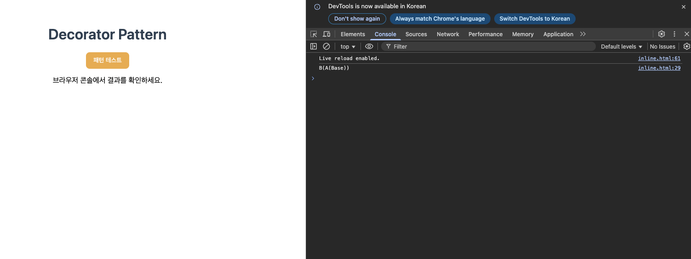
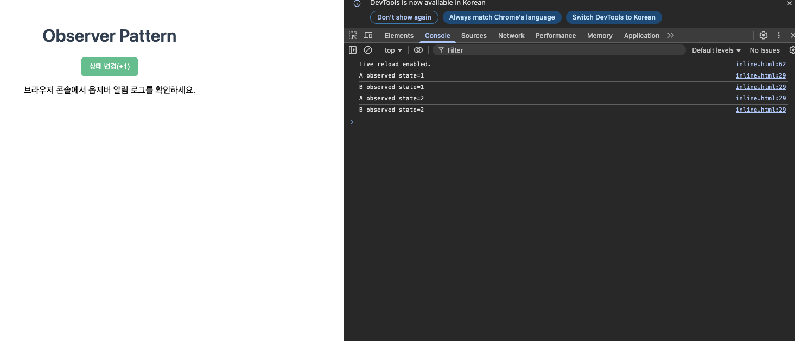

# 디자인 패턴 데모 컬렉션 (TypeScript + Browser/Node)

6가지 대표 패턴을 최소 구현으로 빠르게 시연하고, 브라우저에서 버튼 클릭 → 콘솔 로그를 캡처할 수 있도록 구성했습니다. 각 패턴은 브라우저용 `inline.html`(번들/빌드 불필요)과 Node 콘솔 데모(선택)를 제공합니다.

## 개요
- 포함 패턴: Singleton, Factory Method, Adapter, Decorator, Observer, Visitor
- 목표: 패턴의 의도와 동작을 콘솔 로그로 직관 확인, 과제용 스크린샷 생성 편의 제공

## 폴더 구조(요약)
- `patterns/singleton/`
  - `web/` 브라우저 데모(HTML/TS)와 캡처용 페이지
  - `node/` 콘솔 데모(여러 초기화 방식 포함)
- `patterns/{factory-method|adapter|decorator|observer|visitor}/`
  - `web/inline.html` 브라우저 즉시 실행 파일
  - `node/` 콘솔 데모 소스(`src/index.ts`) 및 빌드 산출물(`dist`)

예시 경로
- `patterns/adapter/web/inline.html`
- `patterns/observer/node/src/index.ts`

## 캡처 저장 위치
- 이미지는 `docs/screenshots` 폴더에 저장하세요.
  - 예) `docs/screenshots/singleton.png`, `docs/screenshots/adapter.png`

## 브라우저 실행(캡처용, 권장)
- 각 패턴의 `web/inline.html` 더블클릭 → 개발자도구 Console에서 버튼 클릭 로그를 캡처
- 파일 프로토콜 제한이 있으면 간단 서버로 열기:
  - `python3 -m http.server 5173` → `http://localhost:5173/patterns/<pattern>/web/inline.html`

## Node 콘솔 실행(선택)
- Singleton: `npm run build:singleton && npm run start:singleton`
- Factory Method: `npm run build:factory && npm run start:factory`
- Adapter: `npm run build:adapter && npm run start:adapter`
- Decorator: `npm run build:decorator && npm run start:decorator`
- Observer: `npm run build:observer && npm run start:observer`
- Visitor: `npm run build:visitor && npm run start:visitor`

## 패턴별 요약 & 캡처 포인트

### 1) Singleton
- 의도: 애플리케이션 전역에서 단 하나의 인스턴스 보장
- 변형: Eager, Static Block, Lazy, Module-level(ESM 캐시)
- 열기: `patterns/singleton/web/vue-inline.html`
- 콘솔 예: 생성 로그 → “같은 인스턴스인가요? true”
- 스크린샷: 

### 2) Factory Method
- 의도: 객체 생성 책임을 서브클래스로 위임해 결합도 ↓ 확장성 ↑
- 열기: `patterns/factory-method/web/inline.html`
- 콘솔 예: `Creator worked with [A]`, `Creator worked with [B]`
- 스크린샷: 

### 3) Adapter
- 의도: 호환되지 않는 인터페이스를 변환해 기존 코드를 재사용
- 열기: `patterns/adapter/web/inline.html`
- 콘솔 예: `Adapter translates ]--Legacy--[`
- 스크린샷: 

### 4) Decorator
- 의도: 상속 없이 런타임에 기능을 합성/확장
- 열기: `patterns/decorator/web/inline.html`
- 콘솔 예: `B(A(Base))`
- 스크린샷: 

### 5) Observer
- 의도: 주제(Subject)의 상태 변경을 구독자에게 통지
- 열기: `patterns/observer/web/inline.html`
- 콘솔 예: `A observed state=1`, `B observed state=1` … (버튼 누를 때마다 +1)
- 스크린샷: 

### 6) Visitor
- 의도: 데이터 구조는 고정, 연산을 방문자 객체로 분리해 추가/교체 용이
- 열기: `patterns/visitor/web/inline.html`
- 콘솔 예: `Visited A`, `Visited B`
- 스크린샷: 

## Singleton 변형 상세
- Eager: 클래스 로드 시 `private static readonly`로 즉시 생성. 단순/안정적, 미사용 메모리 점유 가능
- Static Block: `static { try { … } }`에서 예외 처리 포함 초기화 가능
- Lazy: 최초 요청 시 생성. 브라우저/일반 Node는 경쟁 위험 낮음, 메모리 효율 ↑
- Module-level: 모듈 캐시를 이용한 사실상 싱글톤(`export const service = new Service()`)

## 트러블슈팅
- 빈 화면: 개발자도구 Console 에러 확인(경로 404, CORS 등)
- 파일 프로토콜 제한: 간단 서버로 열기(위 안내 참고)
- Node 타입 에러: `npm i -D typescript @types/node` 후 재빌드

